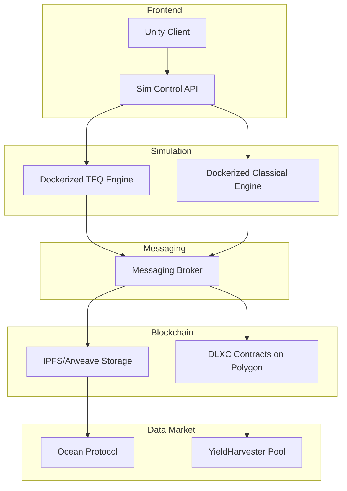
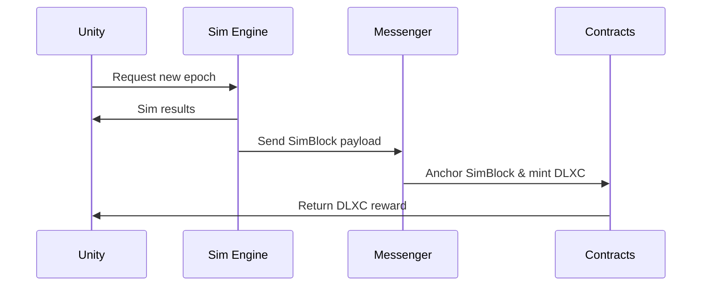

# Architecture Overview

```mermaid
flowchart TD
    subgraph Frontend
        A[Unity Client] --> B[Sim Control API]
    end
    subgraph Simulation
        B --> C[Dockerized TFQ Engine]
        B --> D[Dockerized Classical Engine]
    end
    subgraph Messaging
        C --> E[Messaging Broker]
        D --> E
    end
    subgraph Blockchain
        E --> F[DLXC Contracts on Polygon]
        E --> G[IPFS/Arweave Storage]
    end
    subgraph Data Market
        G --> H[Ocean Protocol]
        F --> I[YieldHarvester Pool]
    end
```

## Simulation Lifecycle

```mermaid
sequenceDiagram
    participant U as Unity
    participant S as Sim Engine
    participant M as Messenger
    participant C as Contracts
    U->>S: Request new epoch
    S->>U: Sim results
    S->>M: Send SimBlock payload
    M->>C: Anchor SimBlock & mint DLXC
    C->>U: Return DLXC reward
```
